# Customer Intelligence MCP server

**A company's first internally built Model Context Protocol server.** It puts the customer record in front of anyone who asks a question in plain language, from inside the assistant they already have open.

| MCP tools | Tests | Colleagues using it | My rank by usage |
|:--:|:--:|:--:|:--:|
| **14** | **744** | **39** | **9th** |

**Where:** a venture-backed SaaS company, 2026. Source is private.

---

## What it is

Three ETL pipelines feed a Postgres and pgvector store holding the qualitative customer record: post-mortems, call transcripts, sales emails, and deal outcomes. Thousands of documents, hundreds of thousands of emails, thousands of closed deals.

One substrate fed three different appetites. Product got voice of the customer, revenue got win-loss, and the executive team got trend search.

Before it there was no queryable memory of what customers had said. The precursor was a hosted chatbot wired to a few webhooks, and it superseded that.

---

## Keeping the corpus honest

A search tool is only as good as what it is searching. One of the three pipelines manufactures the post-mortem corpus, and its extraction step is where a wrong answer would be invisible: a hallucinated field does not look like an error, it looks like a record.

So extraction routes by archetype, runs deterministic signal detectors before any model call, and gates every extracted field against the evidence it came from. **False positives fell from 49.8% to 3.7%** across six gated runs, against a hard 5% ceiling the redesign had to clear before it was allowed to ship.

---

## The request path

<picture>
  <source media="(prefers-color-scheme: dark)" srcset="diagrams/request-dark.svg">
  
</picture>

Every piece of that was a lesson paid for once. The managed agent runtime was chosen over serverless functions in a decision record. The obvious SSO vendor was tried and rejected because it issues opaque tokens rather than JWTs. Direct database driver access replaced a REST layer whose idle connections kept getting force-closed. VPC mode with a static egress IP exists so there is a single address to allowlist.

The per-user attribution hook is why any adoption number on this page exists at all. It was built into the platform rather than the tool, so anything else built on the same scaffolding gets its usage data without asking.

**The part I am proudest of has someone else's name on it.** The company's data engineer built a data warehouse MCP server on this scaffolding, and it became one of the few internal tools with real multi-user reach. A playbook that only its author can follow is not a playbook.

One scar worth naming: the agent runtime accumulates state across in-place redeploys and eventually corrupts. After enough deploy versions the only recovery was to destroy and recreate rather than patch. That is now written down, because the next person to hit it will be looking at symptoms that suggest their code.

---

## Retrieval

<picture>
  <source media="(prefers-color-scheme: dark)" srcset="diagrams/retrieval-dark.svg">
  
</picture>

Semantic and lexical signals get fused through reciprocal rank fusion rather than one being picked as the winner, on 3,072-dimension embeddings, with results widened to a context window either side of the match so a hit lands with the conversation around it.

Keyword mode reuses the full-text index that already existed, so cross-corpus fusion arrived without bolting on a second search system.

**Precision@5 went from 29% to 62%**, a gain of 32.8 points. The largest single contributor was the embedding model, which I would not have guessed going in. That is the entire reason the comparison existed.

---

## The gate everything went through

<picture>
  <source media="(prefers-color-scheme: dark)" srcset="diagrams/evalgate-dark.svg">
  
</picture>

Every embedding and retrieval change needed an objective answer. Vibes cannot decide a migration, and it turned out a model could not either.

I measured a **12-point run-to-run swing on identical inputs** from a model acting as judge. Same config, same data, three runs. A grader that moves 12 points cannot gate anything, so model-as-judge was banned in a written decision record and the suite went deterministic: hit rate, precision@5, MRR, hit@10, and nothing that requires an opinion.

| Property | Why |
|---|---|
| 101 hand-labelled records | Auto-generated ground truth scored worse than random on thematic queries |
| 330 queries, 300 factual and 30 persona-based | The two kinds fail differently and had to be separable |
| Ground truth frozen by checksum | A gold suite you can quietly edit is not a gate |
| Dual-column embedding migration | Old and new coexist, so a failed cutover is reversible |

It killed several plausible ideas cheaply, and it blocked a redesign of my own that I then held back for five months rather than shipping on an override. That story is the [evaluation practice](../evaluation-practice/) page, because it is the thesis rather than a footnote.

---

## Adoption

**39 colleagues, every one of them active in the last 30 days.** The CEO was the heaviest user and out-used me by roughly ten to one. I came ninth on my own tool.

I would rather report that than hide it. A tool whose author is its main user has not been adopted, it has been announced.

---

## Operations

The eval suite was promoted from something I ran to a weekly scheduled job with dead-man alarms on it. An alarm that only fires on a bad result cannot tell the difference between a good result and no result at all, so a suite that stops running would otherwise look exactly like a suite that keeps passing.

A separate triage agent watches the infrastructure alarms with a four-tier action model, from open a fix and merge it at the bottom, up to waking a person at the top, behind a kill switch that defaults to off. Autonomy is opt-in and revocable in one place.

It was gated at 100% tier-classification accuracy across 25 cases before it was allowed to run at all, because the tier decision is the load-bearing one. Everything downstream is a consequence of getting that classification right, so that is what got graded.

On its first day it corrected a cold-start misconfiguration and switched off a notification topic that had been sending more than 40 false pages a night.

---

Retrieval and extraction figures are measured, against a deterministic suite with a frozen ground truth. Adoption is measured through the per-user attribution built into the platform. Source is private and owned by a former employer.
