# Evaluation practice

**How I decide whether a change is allowed to ship, and the four times my own measurement told me no.**

| Queries in the suite | Hand-labelled records | Changes I killed | Months I held one back |
|:--:|:--:|:--:|:--:|
| **330** | **101** | **4** | **5** |

---

## Why this page exists

I built the eval training because I wanted to understand this at a far deeper level than anything I could find online. Most of what is written about evals stops at "write an eval." The part nobody covers is how to tell whether the eval itself is any good, and that turns out to be the whole game.

Everything here came out of getting it wrong first. The gate that could not go red, the grader that moved twelve points on identical inputs, the four changes I was sure about. This is the practice I now bring to every build, including the ones on the other pages here.

---

## The rule

A gate that cannot go red is not a gate.

Everything below follows from that. It sounds obvious written down and it is violated constantly, usually not by anyone cutting corners but by a suite that was never capable of failing in the first place.

<picture>
  <source media="(prefers-color-scheme: dark)" srcset="diagrams/decision-dark.svg">
  
</picture>

---

## Why the LLM judge got banned

I was gating retrieval quality with a model as judge, which is the default answer and a good answer for things with no ground truth.

Then I ran the same inputs twice and the score moved twelve points.

Not twelve points between two versions of the system. Twelve points on identical inputs, run to run. Every conclusion I had drawn from that gate was inside its own noise floor. I banned model-judged quality gates by written decision record and rebuilt on something deterministic.

| The suite | Why it is built that way |
|---|---|
| 330 queries, 300 factual and 30 persona-based | The two kinds fail differently, so they had to stay separable |
| 101 records labelled by hand | Auto-generated ground truth scored worse than random on thematic queries |
| Ground truth frozen by checksum | An answer key you can quietly edit is not a gate |
| Hit rate, precision@5, MRR, hit@10 | Nothing on that list requires an opinion |
| Old and new embeddings coexisting during a migration | A cutover you cannot reverse is a bet, not a change |

The suite is slower to build. It can also go red for a reason you can point at.

---

## The four changes I killed

Each of these was a change I expected to work, built, measured, and threw away.

**Hybrid search that reported a 28.8-point gain.**

<picture>
  <source media="(prefers-color-scheme: dark)" srcset="diagrams/honest-dark.svg">
  
</picture>

Full measurement put it two points net negative. This is the one I tell people about, because the initial number was not fabricated and was not a bug. It was real, on a slice that did not represent the query distribution.

A number can be honest and still be wrong about the thing you are asking it.

**Multi-vector retrieval, 74% worse.** Fast to kill, at least.

**Time decay weighting.** The intuition is strong. Recent documents matter more. The measurement disagreed.

**A cheaper reranker model, 8.2 points down.** Cost saving that was not.

Four changes, all of which I believed in enough to build. That ratio is roughly what I expect now, and it is the argument for the suite rather than an argument against my judgment.

---

## Holding a change back for five months

<picture>
  <source media="(prefers-color-scheme: dark)" srcset="diagrams/hold-dark.svg">
  
</picture>

I built a redesign I believed in and it came in at 77.8 against a bar of 83.3. I held it for five months rather than override the gate I had written myself.

The part worth noticing is that the eval did more than refuse. Its own diagnosis pointed at where the loss was coming from, I built the multi-stage fusion it implied, and the gate was met honestly. One residual case stayed worse than the incumbent and was accepted in writing rather than rounded away.

The override was never signed. The whole apparatus is worthless the first time its author waves it through.

---

## The instrument needs the same scrutiny as the code

The failure I keep meeting is not a bad result. It is a good result from a broken instrument, and it never announces itself.

A tuning session on a personal project ran two clean populations of latency data before I noticed the configuration had never reached the component being configured. Both populations had measured the same pinned default. Nothing errored. Nothing warned. The numbers were plausible. ([Full account here.](../sincta/#what-the-defect-log-is-for))

From the same project, written down after meeting each one:

- A test that exercises the code without reaching the condition is the default outcome
- A green test whose stated reason is false is worse than a missing test
- A fake that hardcodes the answer green-lights a seam no real object ever crossed
- A synthetic fixture that flatters the code under test is worse than no fixture
- A check that cannot tell success from the work not happening is not a check
- A negative assertion fails silently when the value under test moves
- A closed list of outcomes with a member nothing can produce is a claim with nothing behind it

Seven ways to hold a passing test that proves nothing. I have shipped every one of them.

---

## Running it as infrastructure

A suite I remember to run is not a gate either. The eval was promoted to a weekly scheduled job with dead-man alarms on it, so a suite that stops running cannot look like a suite that keeps passing.

That is the same shape as the checks that never ran on the personal project, met from the other direction. An alarm that only fires on a bad result cannot tell the difference between a good result and no result at all.

---

## Teaching it

I built a 16-unit hands-on curriculum out of this, because the reflex is the transferable part rather than any particular suite. Three tutors ship inside it, each one behind its own passing eval, which felt like the minimum honest bar for a course about evals. Learners build a project and grade it across nine eval suites of their own.

It has not been run with a cohort. I would rather say that than let a page imply an audience it never had.

The thing worth teaching is not how to write an eval. It is how to catch one that is subtly wrong, which is a harder skill and the one everything else depends on.
