# Investigation workflow

**An agentic workflow that runs the full Tier 2 support lifecycle.** Take a ticket, route it, map the relevant part of the codebase, pull the logs, check the infrastructure, and arrive at a root cause or a directed escalation.

| Benchmark tickets | Routing match | Misroutes | Playbooks |
|:--:|:--:|:--:|:--:|
| **50** | **91%** | **0** | **6** |

**Where:** a venture-backed SaaS company, 2026. Source is private and owned by a former employer, so this describes architecture and outcomes.

---

## The problem

A Tier 2 ticket meant an engineer manually mapping code, pulling logs, checking infrastructure, and reasoning to a cause. Thirty minutes a ticket at the low end, and a large share of it escalated to product engineering.

The support engineers were capable of the reasoning. What they lacked was the map and the access.

---

## The lifecycle

<picture>
  <source media="(prefers-color-scheme: dark)" srcset="diagrams/lifecycle-dark.svg">
  
</picture>

Six playbooks in sequence, defined in a skill file that reached about 4,900 lines by version 1.1.0, sitting on a QA operating book running to hundreds of thousands of words. It reads a companion architecture map and live cloud logs through a dedicated IAM account provisioned for it.

What comes out is a routed ticket and a directed investigation, plus a fix where the thing is fixable.

---

## Two numbers, and they are not the same number

| What was measured | Result |
|---|---|
| Routing and investigation direction, 50-ticket benchmark | **91% match**, up from 70% |
| Misroutes | **0** |
| Full autonomous resolution | **54% clean**, 37% partial |

State those separately and never collapse them. The 91% is the operationally useful number, because the workflow multiplies a Tier 2 engineer rather than replacing one. Quoting it as a resolution rate would be a lie by compression.

---

## Where the 21 points came from

Not a prompt rewrite. I made the agent tag every claim it had grounded in code it had opened and read, then watched the count of those tags go from 28 to 68 across the benchmark.

The gain came from verifying code rather than writing better prose about it. That is worth saying plainly, because the instinct when an agent underperforms is to reach for the wording, and the wording was not what was wrong. The agent was asserting things about a codebase it had not looked at, and the fix was to make that visible in its own output so it could be counted.

---

## When the access is not there

<picture>
  <source media="(prefers-color-scheme: dark)" srcset="diagrams/access-dark.svg">
  
</picture>

A support engineer without full system access still gets a completed investigation and a directed escalation rather than a failure. The escalation lands on an engineer's desk with the work already done.

That was the difference between a tool that helps the most senior person on the team and a tool that helps everyone. It is the design decision I am most confident was right.

One system's access was confirmed unobtainable. Rather than keep tuning against a wall, I recorded the workflow as at its ceiling and named the reason. Somebody reading that benchmark a year later needs to know whether they are looking at an access limit or a skill deficiency, and those two things degrade very differently over time.

---

## The map it stands on

<picture>
  <source media="(prefers-color-scheme: dark)" srcset="diagrams/map-dark.svg">
  
</picture>

The map of the repository estate is its own artifact with its own version history, rather than a section inside one monolithic skill. Each half can be validated and versioned independently, and the map gets reused by things that are not the investigation workflow.

It covers the estate across more than a dozen domains, with the highest-traffic services deep-read, distilled down from raw research into a file of roughly 620 lines by version 1.5.7. Every claim in it carries a verification status, and it ends at zero unverified claims.

For someone who is not writing code every day, that is the only defensible bar for a document engineers route off. The strongest thing about it is who tested it. Four senior platform engineers, the owners of the repositories it describes, went through it and filled the gaps they found. That is the reverse of the usual arrangement where engineers vet a non-engineer's document and quietly stop reading.

---

## Adoption

Distributed company-wide through managed settings, to the Tier 2 engineering group. Validated by the VP of Engineering and three senior engineers.

One engineer took it as the foundation for an agent of his own. That is the adoption signal I trust most, because nobody builds on a tool they had to be told to use.

---

## What I would tell you in an interview

The interesting part of this project was not the agent. It was working out that the bottleneck was never the reasoning.

Support engineers could reason about these tickets fine. They could not see the code and they could not see the logs, so most of that thirty minutes went into assembling context rather than thinking. Once that was clear, the design question stopped being "how do I make an agent that debugs" and became "how do I get the context in front of the person."

Everything else on this page follows from that reframe, including the part where an engineer without access still gets a finished investigation.

---

Numbers here are measured: a 50-ticket benchmark with a known method and a date. Adoption and validation are reported, meaning real and attested but not instrumented.
