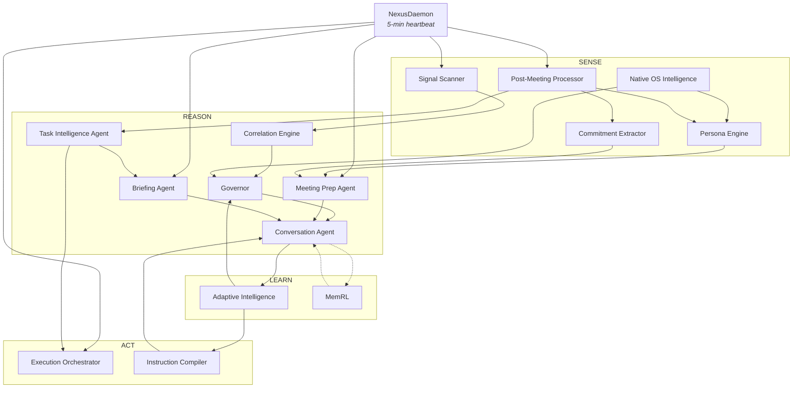
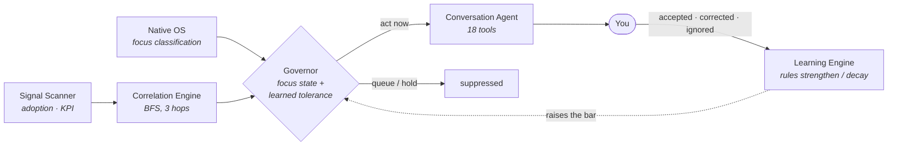
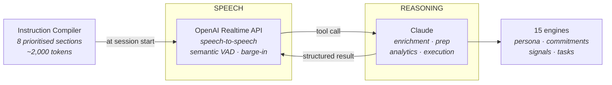

# Nexus

**A voice-first AI chief of staff.** Fifteen intelligence engines running continuously over calendar, meetings, colleagues, projects and commitments, deciding what actually needs a person and staying quiet about everything else.

`Personal R&D` · `single user` · `March – July 2026` · `frozen at a written gate`

| Intelligence engines | Backend services | Tests at freeze | Process-context layers |
|:--:|:--:|:--:|:--:|
| **15** | **93** | **~3,982** | **6** |

---

## The premise

A knowledge worker's context is scattered across Slack, calendar, transcripts, Confluence, Jira, a CRM and their own memory. Most tools answer that by aggregating everything into a dashboard, which moves the sorting problem from many places to one place without solving it.

Nexus inverts it. Every engine below exists to earn the right to interrupt. Signals are detected, correlated against other signals, weighed against what you are currently doing, and then mostly suppressed. What survives is a draft to approve, a call to prepare for, or a decision only you can make.

**The hard part is deciding not to speak.**

---

## The system

Four phases, one loop. Solid edges are wired and running. The dashed pair is built and not connected, which is covered honestly further down.

> [!NOTE]
> An interactive version of this map, where each engine opens its own detail, is linked at the bottom of this page.

---

## How a signal becomes an interruption, or doesn't

The loop closes on the Governor. Every time a surfaced signal is accepted, corrected or ignored, a confidence-scored rule is created or adjusted. Rules that get reinforced become permanent preferences; rules that get contradicted decay and deactivate.

The practical effect is that the threshold for interrupting you **rises over time** on the signal types you have shown you do not care about.

---

## Two models, split by what they are good at

Speech-to-speech is where you want the conversation, not the thinking. The Realtime API holds the turn and keeps the voice natural over a WebSocket, while Claude reasons behind exposed tool definitions. Async function calling means the voice can keep talking through work that takes seconds.

Measured cost of the split, written down rather than assumed:

| Constraint | Measured |
|---|---|
| Added latency on complex queries | 800 – 2,000 ms |
| Session length | Hard limit, no automatic reconnection |

---

## Six views, driven by voice

The screen follows the conversation. Ask about a person and People appears; make a decision and it executes and confirms.

| View | What it holds |
|---|---|
| **Home** | Morning briefing, today's plan with readiness scores, blocked decisions, active signals |
| **Calendar** | Per-meeting preparation scored 0–100%, with talking points and open commitments per attendee |
| **People** | Colleague profiles with relationship health, communication style, and an epistemic grade from A to F |
| **Projects** | Roadmap and consulting portfolios with health, execution state and QBR readiness |
| **Analytics** | Adoption and impact metrics as conversational insights, every number drillable |
| **Live** | The voice surface. Speech, touch and keyboard together |

---

## Every engine

<b>SENSE</b> — five engines that watch

 

**Signal Scanner** · *Built, scans Supabase and BigQuery*
Watches adoption metrics and KPI data for anomalies: adoption drops, usage spikes, power-user dropoff, gaps and KPI movement. Anything unusual becomes a signal.

**Native OS Intelligence** · *Built, Electron main process*
Observes apps, focus, processes and screen at the OS level, then classifies focus state on a five-minute sliding window. This is what tells the Governor whether you are in deep work.

**Persona Engine** · *Built, multi-source enrichment*
Builds a profile of every colleague from meeting transcripts, Slack, Confluence, calendar and native observation. Tracks communication style, decision patterns, relationship health, and an epistemic grade from A to F for how well it actually understands them.

**Commitment Extractor** · *Built, deadline tracking*
Reads meeting transcripts for mutual commitments, both what you promised and what was promised to you, with explicit or inferred deadlines. Overdue items surface in briefings and meeting prep on their own.

**Post-Meeting Processor** · *Built, daemon-triggered*
On meeting end, pulls the transcript and runs commitment extraction, signal extraction and persona enrichment, creates tasks from action items, and stores a structured summary. No manual trigger.

<b>REASON</b> — six engines that decide

 

**Correlation Engine** · *Built, graph traversal*
Traverses the entity graph breadth-first to three hops to find connections between separate signals, then has Claude write the correlation chain and a suggested action. An adoption drop plus a stakeholder going quiet becomes one insight rather than two data points.

**Governor** · *Built, Silent / Proactive / Strategic*
Sits between detection and surfacing. Weighs each signal's urgency against your current focus state and decides to surface, queue or suppress. Critical act-now signals are never suppressed. The interruption modeller feeds it, learning which signal types you consistently ignore.

**Conversation Agent** · *Built, text and voice*
The reasoning loop behind every chat and voice turn. Runs up to ten tool iterations per turn across 18 tools in parallel, then synthesises. In voice mode it streams with sentence-boundary detection so speech lands naturally.

**Briefing Agent** · *Built, scheduled and on demand*
Gathers tasks, open commitments, drift signals, calendar and project status into a morning or evening briefing, and pre-populates the daily plan so you subtract rather than build from scratch.

**Meeting Prep Agent** · *Built, daemon-triggered*
Thirty minutes before a meeting, pulls attendee personas, open commitments with those people, project context and recent interactions, then generates talking points, coaching per communication style, and flags risks like an overdue promise to an attendee.

**Task Intelligence Agent** · *Built*
Enriches each task with context from Notion, Confluence, transcripts and project data, produces an execution brief naming dependencies and missing information, and assigns a readiness score so unready work does not clutter the plan.

<b>ACT</b> — two engines that do

 

**Execution Orchestrator** · *Built, concurrent sessions*
Runs the tasks that do not need your judgment. Builds a context package, picks a transport between the Claude Agent SDK and a terminal session, monitors progress and self-heals on failure. A three-tier safety gate separates auto-execute from confirm from block, and it never sends external communications unasked.

**Instruction Compiler** · *Built, 8 sections, ~2,000 tokens*
At voice session start, queries every intelligence component for learned rules, pending commitments, active signals, predictions and recent session memory, then assembles a prioritised instruction set inside a per-section character budget.

<b>LEARN</b> — two engines that improve, one of which is not plugged in

 

**Adaptive Intelligence** · *Built, 9 service files*
Three parts. The learning engine turns every correction into a confidence-scored rule that strengthens on reinforcement and decays on contradiction. The signal cortex scores cross-system events for urgency without API calls. The instruction compiler assembles the result into live context.

**MemRL** · *Built but NOT wired into prompt assembly*
Stores every output as a trajectory with a Q-value that rises on acceptance and falls on neglect. High scorers become exemplars, low scorers get pruned. Scoring, promotion, pruning and feedback logging are all implemented.

<b>NexusDaemon</b> — the heartbeat

 

**NexusDaemon** · *Built, 10+ scheduled jobs*
A five-minute heartbeat that checks whether a briefing is due, a meeting is 30 minutes out, signals are stale, commitments are approaching deadlines, or autonomous tasks are ready. Each check is independent and wrapped so one failure never blocks the others.

---

## Honest status

> [!WARNING]
> **One engine is built and not plugged in.**
>
> MemRL stores every output as a trajectory with a Q-value that rises when you accept it and falls when you ignore it. High scorers get promoted to exemplars, low scorers get pruned. Q-value updates, promotion, pruning and feedback logging are all implemented and tested.
>
> The integration point into the conversation agent's prompt assembly does not exist. Trajectories are scored and stored and never injected into Claude's context. It is the single highest-leverage improvement available to the project and it is not done.

The project was frozen deliberately in July 2026 at a written gate, with a handoff covering current state, remaining work, and the decisions that must not be casually reversed, so another engineer or agent could resume it cold. It stopped because it had answered the question it was built to answer.

---

## What it runs on

| Layer | Technology | Purpose |
|---|---|---|
| Desktop | Electron 35, macOS arm64 | System tray, global shortcuts, OS-level observation |
| UI | Svelte 5 runes | Six views on a shared token-driven design system |
| Backend | Express 4, localhost only | 93 service files, 31 route files, runs as a child process |
| Reasoning | Claude, Anthropic SDK and Agent SDK | Conversation, briefing, execution, enrichment |
| Voice | OpenAI Realtime API | Speech-to-speech with barge-in and semantic VAD |
| Local STT | Sherpa-ONNX | On-device transcription, no cloud path |
| Local store | better-sqlite3 | Persona data, trajectories, learned rules, intelligence state |
| Cloud store | Supabase, Postgres and pgvector | Tasks, analytics, vector search |
| Sources | Google Calendar, Granola, Slack, Confluence, BigQuery | Meetings, transcripts, messages, docs, KPIs |

---

Source is private. Every count and status on this page comes from the repository at its July 2026 freeze.
