# Sincta

**A dictation app for macOS with no network path at all.** Double-tap Fn, talk, tap once to stop, and the words appear in whatever you were working in. Capture, transcription and delivery all happen on the machine.

| Commits | Days | Tests at last merge | Decision records |
|:--:|:--:|:--:|:--:|
| **1,009** | **23** | **3,313** | **9** |

---

## The premise

I wanted dictation and could not use a cloud tool. The commercial answer sends your speech to a server, which was the one thing I would not accept. So the constraint came first and the architecture fell out of it. If no audio may leave the machine, every cloud speech vendor is out no matter how fast or accurate, and the whole design collapses onto Apple's on-device Speech frameworks.

That is the most useful thing about this project as an engineering exercise. It removed the easy path on day one, and everything after that had to be earned.

A privacy promise is worth what the instruments say it is worth. **The benches refuse to run while a routable network interface is up.**

---

## The path a dictation takes

<picture>
  <source media="(prefers-color-scheme: dark)" srcset="diagrams/path-dark.svg">
  
</picture>

Electron holds the shell, because menu bar presence, onboarding and settings iterate faster there than in SwiftUI. Two native Swift addons reach what Node cannot. One wraps Apple's `DictationTranscriber` for transcription. The other handles the global hotkey through Input Monitoring, and posts the paste keystroke.

Both bridges are load-bearing. If either fails to build or package correctly, the app has no speech or no trigger.

The recording pill renders on four of the controller's seven internal states and on nothing else. The two states it stays hidden for are the ones where the app cannot yet promise a dictation is happening: the double-tap arm window, and the gap after a second tap where capture is not confirmed. Showing a signal about capture before capture is confirmed is the exact bug class the rule exists to forbid. The one exception is error, which shows the pill even from a hidden state, because a denied permission or a dead engine producing no signal at all is worse.

---

## Where the time goes

The engine's own final does not land within the flush window, so the app promotes its own text at 360 ms rather than waiting. The Phase 2 gate then turned up something more useful than a median. Across 25 dictations the entire spread was **37 ms**. Perceived latency was not variable engine work, it was a fixed timer plus a near-constant delivery cost.

That is why the tuning three phases later was a knob turn instead of a re-architecture, and why moving the flush window moves the whole distribution rather than its tail.

| Gate | Measured | Budget |
|---|---|---|
| Stop tap to keystroke posted, median, n=50 | **532 ms** | 560 ms |
| Same, p95 | **541 ms** | 700 ms |
| Cold engine prewarm | **82 ms** | 150 ms before keep-warm is needed |
| Pill first frame, packaged, median, n=13 | **8 ms** | 100 ms |
| Memory growth, three ten-minute sessions | **26 MB** | 50 MB |
| Memory slope at the end | **−0.27 MB/min** | 1 MB/min |
| Word error rate, jargon-salted corpus | **18.3%** | baseline only, no gate |

Every number came out of a bench script whose raw JSON is committed next to the code that produced it, with the date and the machine attached.

Two things travel with that table. The soak verdict is `PASS-WITH-GAPS` rather than PASS, because four of its criteria had no observable metric in the log window and are recorded as not evaluated instead of being folded quietly into a pass. And the error rate is a July baseline over twelve sentences, taken before the vocabulary corrector existed, so it measures the raw engine rather than what the app delivers now.

Overriding the network refusal stamps `network.overridden: true` into the result JSON and disqualifies it from any gate. A latency or accuracy number taken with a network path available proves nothing about an on-device claim.

The pill's first-frame number carries its own honesty clause in the source. It measures the first animation-frame callback after the state message landed, acked back over IPC. It does not measure photons, because macOS gives the process no signal about when a compositor put a frame on the display. Whether a human saw the pill is covered by an attended sitting, the same as every other claim a machine cannot check from the inside.

---

## Where the words go

<picture>
  <source media="(prefers-color-scheme: dark)" srcset="diagrams/target-dark.svg">
  
</picture>

The paste posts Cmd+V into whatever owns the keyboard at that instant. That was the same thing as "the app the user dictated into" right up until the recording pill became clickable. On macOS a click on any window of an app activates that app, so a user who stops by clicking the pill has made Sincta frontmost before the paste begins, and the keystroke lands in Sincta.

Nothing in the result said so. `ok: true` means written and posted. macOS gives a process no signal about where a synthetic keystroke ends up.

The fix is an ordering, not a window flag. Electron exposes no way to make a clickable window non-activating, and the decision record carries the four documented statements that close that door along with the alternatives that were rejected. The target is resolved at the stop event, and an answer of "Sincta" is never trusted. It falls through to a tracker that remembers the last real app it saw, seeded when the session is established and kept current by a poll for as long as the session lives.

Failure there is never allowed to cost the words. A refused activation, an activation that throws, and no captured target at all all proceed to the paste exactly as the app did before the change. Counted, rather than silent.

---

## The text pipeline

<picture>
  <source media="(prefers-color-scheme: dark)" srcset="diagrams/pipeline-dark.svg">
  
</picture>

The order is load-bearing. Sentence shape runs last because filler removal changes which word is first. Capitalise before you strip a leading "um" and you capitalise the filler, then delete it, and the real first word is left lowercase. Every transform passes. The output is wrong.

Each transform receives the resolved target app alongside the text. That is what makes code mode a suppression rule keyed on app context rather than a second dictionary, which is the per-app profile primitive the roadmap wanted.

Every user-changeable value in that pipeline is read live, never snapshotted at construction. The rule is written down as a decision record because the codebase broke it twice.

---

## How a phase closes

<picture>
  <source media="(prefers-color-scheme: dark)" srcset="diagrams/gate-dark.svg">
  
</picture>

Ten phases so far, each behind a written gate. A phase does not close on a green suite. Before a gate there is a whole-branch review, then a read-only pass from a second model vendor, then a fix wave where every finding is written up with its mechanism and the rule taken from it.

What a machine cannot produce becomes an attended sitting with a written procedure. Three of those are owed right now and none is waived: a threshold calibration for voice-activity detection on a real microphone, a kill-during-delivery test on the crash-safe spool, and the boundary matrix for hold-to-dictate. Four built features ship switched off behind flags for that reason, each with its prerequisites recorded.

Gate rows for those features read implemented, not observed. That phrasing is deliberate.

---

## Decisions worth reading

<b>Choosing the speech engine</b>

 

I ported the speech code from an earlier personal project, and before porting anything I audited what that project had done with each path rather than assuming it worked. Several were broken, unmeasured or dead.

One module, `DictationTranscriber`, was documented as the right tool for dictation and had never been wired up. Apple's newer `SpeechAnalyzer` path was gated behind an environment flag and marked disabled until stable. A third recognizer opened the microphone, took in audio, and produced zero partials, zero finals and zero errors across twelve sentences and five continuous minutes. It reported on-device capability truthfully the whole time. It was dropped from the fallback chain that day.

The newer module was not the better module, and the only way to know was to go and look.

<b>Accepting a latency number that missed its target</b>

 

The original target was a median strictly under 500 ms. 532 misses it. I accepted the value, stopped the tuning ladder at its first rung, and wrote down why. Every gate other than the strict median line came back clean, and pushing lower would have spent real headroom out of the revision-tolerance budget to chase a threshold that was a judgment call when it was written.

The decision record marks the target as revised rather than met. I would rather ship a documented miss than a met target nobody can reproduce.

<b>The clipboard nuance the README leads with</b>

 

The default delivery path writes the transcript to the system clipboard, and macOS can sync clipboard contents to a user's other signed-in Apple devices through Universal Clipboard. The app marks its writes with the concealed-type identifier so well-behaved clipboard managers skip them, but that sync is system behaviour outside the app's control.

The transcript is also left on the clipboard after delivery rather than being restored to what was there before, so the exposure window lasts until the user copies something else. A pasteboard-free write path exists in the native bridge and is wired into nothing that ships.

All of that is the second paragraph of the project README, above the feature list. A privacy-first app that buries its one residual leak is doing the same thing as the tool it replaces.

<b>The keys bridge posts one keystroke and nothing else</b>

 

The only keystroke-posting function in the native tree is hard-wired to the paste keycode. When a later phase scoped auto-submit, which needed a Return key, the feature was killed rather than granted a general keystroke export. Its config key was removed instead of being left inert.

A dictation app that can synthesise arbitrary keystrokes is a different and much larger security surface than one that can paste.

---

## What the defect log is for

The wiki carries 26 defect writeups. The phase ledgers carry more: 28 in a single overnight build, 25 in the phase after it. Each one records the mechanism and the rule taken from it.

That log is not a bug list. The interesting part is almost never the defect. It is why the thing that was supposed to catch it did not.

**A setting that never reached the thing it configured.** The task was to find the lowest safe flush window. The first sitting produced two clean populations of latency data, one at the default and one at the candidate. Both passed. Both were worthless, because the function constructing the native engine passed no arguments, so the addon's own constructor default decided the value regardless of the config file. Both populations had measured the same pinned number. Nothing errored and nothing warned. The fix added a readback line logging the value the bridge was configured with.

Four phases later, the same defect in a different place. The vocabulary was read once at boot into a corrector that built its dictionary at construction, so a word added in the Dictionary pane would never have reached a dictation until relaunch, with every unit test green. Both are now covered by a written rule and by tests that change a setting on a live graph and assert the next dictation's delivered text changed, rather than asserting a function was called.

**A check that no sequence ran, three times.** The end-to-end suite sits behind a pre-hook. While that hook was red, the suite exited before Playwright started, so a suite that never ran was indistinguishable from a passing one. It stayed that way for a whole phase, which hid that the audio cues had never worked end to end: a second sandboxed preload shared a runtime import with another preload, so the bundler split it into a chunk a sandboxed preload cannot load, and killed both.

Then the same shape a third time. Four boot-proof scripts existed and nothing executed them, not the test command and not the release sequence. Two were red when a phase merged and deployed. The finding is not the stale assertion they tripped over. It is that a real check nobody runs is not a check. Reading the passed count rather than the exit code is now a runbook item, and those four scripts run together under one command that never short-circuits, with separate exit codes for "assertions failed" and "the script could not run at all".

**A counter that flattered the app.** The analytics vocabulary had an outcome for a delivery that failed, and nothing in the codebase produced it. A dictation whose delivery failed counted nothing, so the Activity pane undercounted exactly the sessions a user remembers most, in the direction that makes the app look better. A closed vocabulary is a set of claims about what can happen, and a member nothing can produce is a claim with nothing behind it. Every member of both outcome vocabularies now has a producer proven by driving the real route, or a written reason for its absence, and a test fails on any member left undecided.

<b>Four more from the log</b>

 

**A path resolver green through two reviews.** The addon path resolver shipped, was approved twice, and was touched by several later tasks without ever running inside a packaged bundle. Its first packaged execution threw and blocked boot. In development the addons live at one path, and packaged they land at another. The function had one code path and it happened to be right for the only environment anyone had run it in. Green code and reviewed code are not the same claim as exercised code.

**A fix I dispatched and then held.** The menu bar icon rendered blank on the first packaged launch, matching a defect class this project already knew: assets inside the app archive failing to load. I dispatched a fix on that premise. Before it landed I checked the mechanism, and the image loader returned a valid non-empty image from the real archive path. The glyph was drawn at 68 of 256 alpha pixels and I simply could not see it. Had the fix landed it would have been a no-op sitting on top of an unrelated legibility problem, and it would have looked like it worked.

**A window that shipped unstyled.** The main window's stylesheet consumed sixteen custom properties defined in no token file. An undefined variable reference with no fallback is invalid at computed-value time, so the declarations were dropped and the window rendered bare. Every test was green, because the tests asserted the rules existed rather than that they resolved. A guard now fails any stylesheet consuming a custom property nothing defines, and the visual layer is rebuilt against a design-parity gate whose floor rises with every case it learns.

**A guard that was decorative, and only its own sabotage found it.** A test written to prove a guarantee never asserted that the condition it was about had been reached, so its subject and its verdict were independent and a pass carried no information. The rule taken from it was measured rather than argued: across six deliberately sabotaged cases, every one with an anchor asserting the condition was reached survived, and every one without it did not.

---

## Status

Pre-alpha, in daily use, deployed to `/Applications` on one machine. Self-signed, never notarized, never distributed. A self-signed identity cannot be notarized, and the build is never quarantined or run past Gatekeeper, so it does not need to be.

Phases 0 through 9 are complete and gated GO. The most recent work rebuilt the Home and Activity panes across sixteen tasks against a checked-in design canvas, every task passing an adversarial review gate before it merged. It added per-day counters with a null-prototype map behind them, after a dictionary rule named `toString` corrupted the tally and the reader then zeroed the field.

One item is open and unexplained: a single end-to-end failure that has appeared once in eight full suite runs and never in 228 dedicated reproduction launches. Its most plausible mechanism was excluded by measurement across 80 probes under load. It is deliberately not marked as expected to fail, and deliberately not hardened against the cause that was ruled out, because a fix aimed at an excluded mechanism reads as handled and makes the next occurrence a surprise.

---

## What it runs on

| Layer | Technology | Purpose |
|---|---|---|
| Shell | Electron 43, macOS arm64 | Menu bar presence, onboarding, settings, the recording pill |
| Renderer | TypeScript, token-driven CSS | Four panes plus the pill, no UI framework |
| Speech | Apple `DictationTranscriber`, Swift N-API addon | On-device transcription, no network path |
| Input | Swift N-API addon over Input Monitoring | The Fn gesture, and posting the paste keystroke |
| Delivery | Accessibility and the pasteboard | Target resolution, activation, paste |
| Store | Bounded JSON files, atomic writes at 0600 | Settings, transcript history, per-day counters |
| Tests | Vitest, Playwright, fast-check | 151 test files, end-to-end against the real app |
| Benches | Node scripts with committed result JSON | Latency, accuracy, keys, soak, input levels |

Roughly 37,000 lines of application TypeScript, 58,000 lines of test TypeScript, and 7,500 lines of Swift across the two bridges. Nine decision records, 27 runbook entries, 30 phase and gate documents.

I wrote very little of that by hand. I architect and direct, the model writes the code, and I review for correctness and can explain every design decision. The gates, the benches, the network refusal and the defect log all exist for one reason: a model will hand you a passing result with real conviction, and you need instruments it cannot talk its way past.

---

Source is private. Every count and measurement on this page comes from the repository and its committed bench results, as of 18 August 2026.
